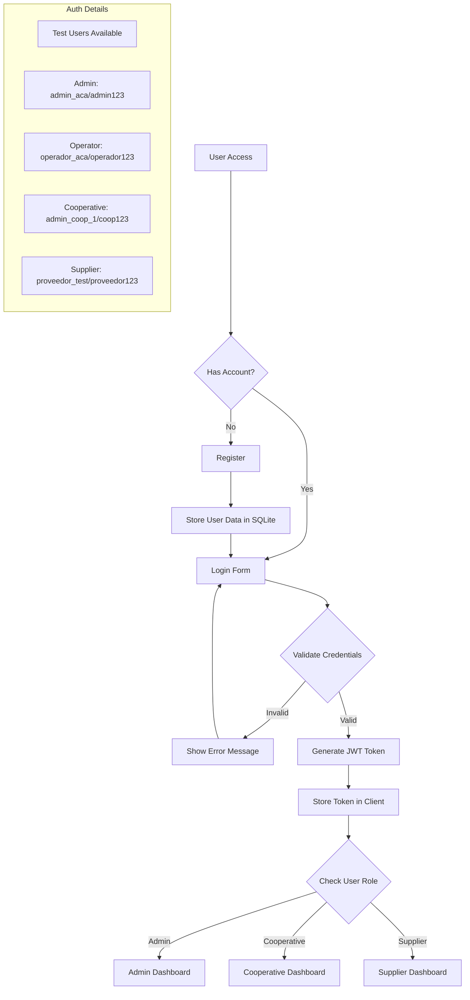
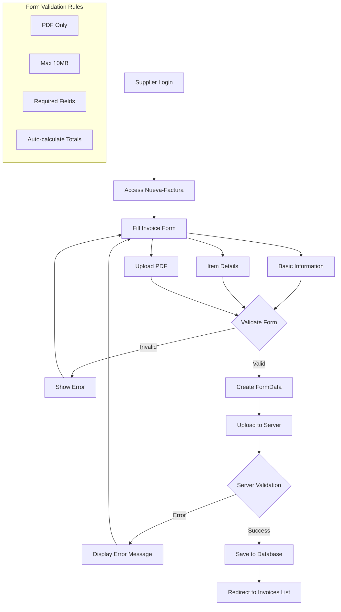
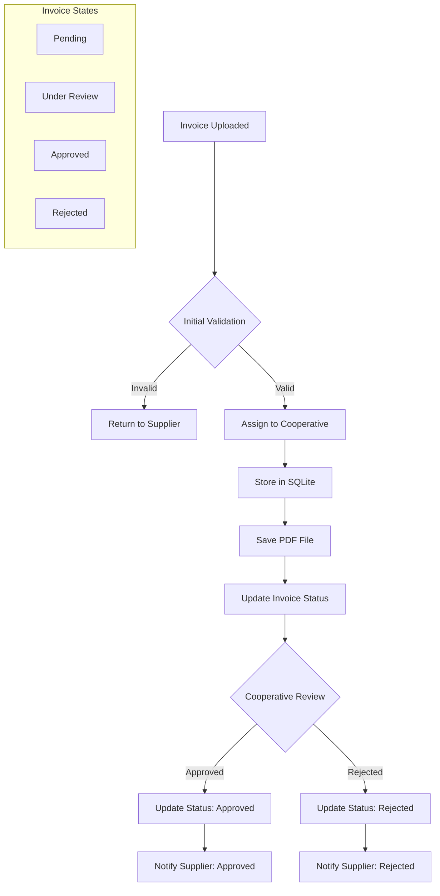
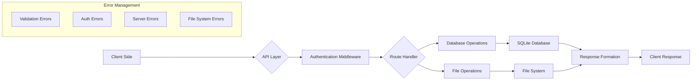
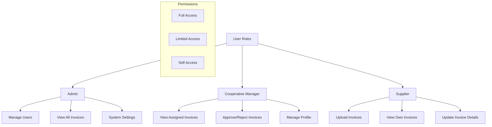

# Design Document: Portal Coop (Cooperativas Admin)

## Project Overview

A management system for Argentinian Cooperatives (Asociación de Cooperativas Argentinas - ACA) that handles cooperative administration, invoice management, and user roles.

## Technical Stack

Frontend (Client)

- Framework: Next.js v14.0.0
- Core Libraries:
  - React v18.2.0
  - React DOM v18.2.0
- Styling:
  - TailwindCSS v3.3.0
  - PostCSS v8.4.31
  - Autoprefixer v10.4.16
- HTTP Client:
  - Axios v1.5.0
- Development Tools:
  - ESLint v8.52.0
  - ESLint Config Next v14.0.0

Backend (Server)

- Runtime: Node.js
- Framework: Express.js v4.18.2
- Database: SQLite3 v5.1.6
- Authentication & Security:
  - bcryptjs v2.4.3
  - jsonwebtoken v9.0.2
- Middleware:
  - CORS v2.8.5
  - Multer v2.0.2 (File uploads)
- Configuration:
  - dotenv v16.3.1
- Development Tools:
  - nodemon v3.0.1

## Project Structure

cooperativas-admin/
├── client/                   # Frontend Next.js application
│   ├── pages/               # Next.js pages
│   │   ├── cooperativa/     # Cooperative-specific pages
│   │   ├── cooperativas/    # Cooperatives listing/management
│   │   └── proveedor/       # Supplier-related pages
│   ├── styles/              # Global styles
│   └── utils/               # Utility functions
├── server/                   # Backend Express application
│   ├── uploads/             # File upload directory
│   │   └── invoices/        # Invoice storage
│   └── cooperativas.db      # SQLite database
└── Data/                    # Data files and spreadsheets

Key Features

1. Authentication System
    - User role-based access control
    - JWT-based authentication
    - Secure password handling with bcrypt

2. Cooperative Management
    - Cooperative profiles
    - Member management
    - Dynamic routing for individual cooperatives

3. Invoice System
    - Invoice upload and storage
    - Invoice validation
    - Assignment to cooperatives
    - Supplier invoice management

4. User Roles
    - Cooperative managers
    - Presidents
    - Suppliers
    - Administrative staff

## Data Management

- SQLite database for data persistence
- File storage system for invoices and documents
- Data import capabilities from Excel/CSV files

## Development Environment

- Concurrent development server support
- Hot-reloading for both frontend and backend
- Environment variable management
- ESLint for code quality
- Custom port configuration (Frontend: 3000)

## Security Features

- CORS protection
- JWT authentication
- Secure file upload handling
- Password hashing
- Environment variable protection

## Application Flow Documentation

### User Authentication Flow

### Invoice Upload Flow

### Invoice Processing Flow

### Data Flow

### User Role Permissions

